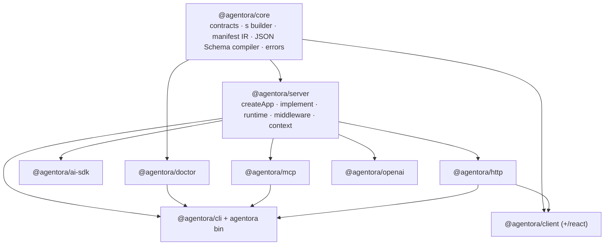
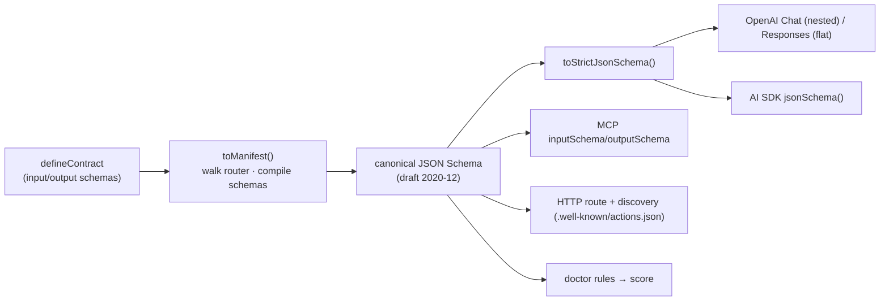
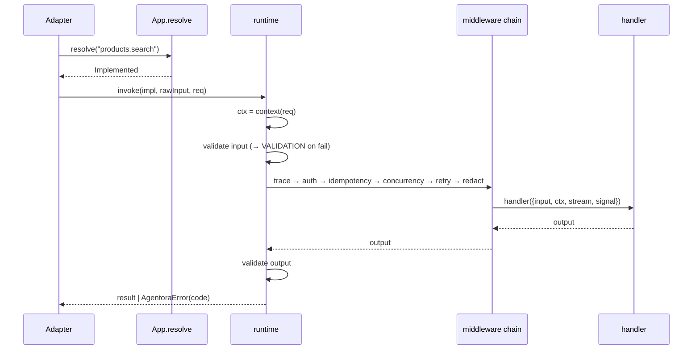

# feat: agentora full build — one contract, every agent surface (eng-297)

Turn the typed `agentora` scaffold into a working SDK across all six README milestones: the core manifest IR and schema compilation, the server runtime and real cross-cutting middleware, every agent surface (MCP, AI SDK, OpenAI, HTTP, CLI, typed client + React), the `doctor` agent-readiness score, and OSS-launch polish. Sequencing follows the dependency spine — every surface reads the manifest the core produces.

This plan is **phased**. Each phase is a coherent vertical that builds and tests green before the next depends on it. Phases map to README milestones.

---

## Problem Frame

Today every package under `packages/` is a **typed scaffold**: interfaces and signatures are defined, bodies are `TODO` stubs (`toManifest` returns empty, `App.resolve` returns `undefined`, every middleware is a no-op passthrough, every adapter returns an empty/501 value). The README/AGENTS.md describe the target API precisely; the work is filling in the implementations without changing the established contracts and design rules.

The load-bearing constraint discovered in research: **Standard Schema v1 exposes only `validate()` and a `vendor` string at runtime — no structural introspection** (`types` is a phantom field, `undefined` at runtime). Compiling contracts to JSON Schema (which every tool surface needs) is therefore only generically possible for schemas whose structure we control. This single fact shapes the core design: the built-in `s` builder must carry an introspectable representation, and bring-your-own (BYO) schemas need a tiered resolver, not a universal converter.

**Non-goals (product identity, per README):** agentora is a *capability layer*, not an agent framework. This plan does not add orchestration, prompt management, memory, or long-running workflow engines. It makes existing capabilities agent-ready by construction.

---

## Requirements

Derived from `README.md` and `AGENTS.md` (the de-facto requirements source; no upstream brainstorm exists).

| ID | Requirement |
| --- | --- |
| R1 | Contracts stay pure, isomorphic, zero-runtime-dependency. `defineContract` carries `name`, `description`, `sideEffects`, `idempotency`, `input`, `output` — **never a handler**. Safe to import in browser/edge bundles. |
| R2 | The manifest IR is the JSON-serializable source of truth: per action `name`, `description`, JSON Schema `input`/`output`, `sideEffects`, `idempotency`, auth metadata. `doctor`, discovery, and external clients consume it. |
| R3 | Each surface is an adapter `(app) => surface`, independently installable; adding one surface must not pull other surfaces into the bundle. |
| R4 | Cross-cutting concerns (auth, idempotency, concurrency, retry, redaction, tracing) compose as typed middleware in `@agentora/server`. Per-contract metadata (`sideEffects`, `idempotency`) is data middleware and `doctor` read. |
| R5 | Runtime-agnostic: streaming standardized on Web Streams / async generators so adapters run on Node and Cloudflare Workers. Handlers receive an `AbortSignal`; cancellation propagates. |
| R6 | `doctor` scores agent-readiness (0–100) by linting the manifest, emitting per-action findings. |
| R7 | Built-in `s` builder works zero-install and compiles to JSON Schema; users may bring any Standard Schema library (Zod/Valibot/ArkType) instead. |
| R8 | The typed client is built from **contracts only** (no server import), safe in a browser/edge bundle; ships React hooks. |
| R9 | The `agentora` bin provides `dev`, `doctor`, `gen`. |
| R10 | OSS launch readiness: docs (agentora.dev), runnable examples, npm publish via changesets, green CI. |
| R11 | Success: `pnpm build`, `pnpm test`, `pnpm typecheck`, `pnpm lint` all green; the README example (define → implement → createApp → toMcp/aiSdkTools/toFetchHandler → createClient) runs end-to-end. |

---

## Key Technical Decisions

These resolve the four scoping call-outs plus the central research findings. Each names the alternative considered.

**KTD1 — Built-in `s` builder is the first-class JSON Schema path; BYO is a tiered resolver.**
The current `s` builder is closure-only (it exposes `validate` but no inspectable structure). Give each `s` node an internal, serializable descriptor (a discriminated `kind` + refinements) and a `toJsonSchema()` that walks it directly. For BYO Standard Schemas, layer a resolver: (1) feature-detect the `~standard.jsonSchema` companion converter and use it; else (2) optionally branch on `~standard.vendor` to a per-vendor converter behind an optional peer dep; else (3) fail loudly or accept a user-supplied JSON Schema alongside the validator. *Alternative rejected:* a universal Standard-Schema→JSON-Schema converter — structurally impossible given the spec exposes no runtime introspection. (See research: Standard JSON Schema companion spec.)

**KTD2 — One canonical JSON Schema (draft 2020-12) plus an OpenAI-strict post-processor.**
Compile each contract once to a clean draft-2020-12 document (MCP's pinned dialect; AI SDK and OpenAI accept a subset). A small shared `toStrictJsonSchema()` transform in core derives the OpenAI/strict variant: `additionalProperties:false` on every object, every property hoisted into `required`, optionals expressed as `["T","null"]` unions, unsupported keywords (length/range/format/pattern) dropped. *Alternative rejected:* emitting different schemas per surface from scratch — duplicates logic and drifts.

**KTD3 — Middleware ships working in-memory defaults behind a pluggable store interface.**
`idempotency` and `concurrency` (and any retry bookkeeping) take a small `Store` interface; v1 ships an in-memory implementation so everything runs out of the box, while leaving the seam for Redis/DB backends later. *Alternative rejected:* shipping no-op stubs (fails R4 in practice) or full external backends now (scope creep). This resolves the **middleware-depth** call-out.

**KTD4 — MCP ships stdio + Streamable HTTP now; OAuth 2.1 is a dedicated, separable unit.**
Use the **low-level MCP `Server`** class (not the high-level `registerTool`, which expects a ZodRawShape) so the adapter emits the raw compiled JSON Schema verbatim. OAuth 2.1 resource-server support for the HTTP transport (Protected Resource Metadata, `401 + WWW-Authenticate`, token-audience validation) is its own unit (U8) so it can ship or defer independently. This resolves the **MCP-auth** call-out: included, but isolated. *Alternative rejected:* high-level `registerTool` (forces Zod, fights the contract-agnostic design). (See research: MCP rev 2025-11-25, SEP-1613.)

**KTD5 — OSS polish is full planned work (docs site, examples, npm publish, CI), not a checklist.**
Per the "entire project" scope, Phase 6 carries real units. This resolves the **OSS-polish** call-out.

**KTD6 — Execution pipeline order is fixed: resolve → context → validate input → middleware chain → handler → validate output → map errors.**
`App.resolve(name)` walks the router tree to an `Implemented`. The runtime composes `use[]` middleware around the handler as an onion; input is validated before middleware, output validated after the handler; thrown errors normalize to `AgentoraError` codes that each surface maps to its own error shape (HTTP status, MCP `isError`, etc.). Per MCP 2025-11-25, input-validation failures surface as tool-execution errors (`isError:true`), not protocol errors, so models can self-correct.

---

## High-Level Technical Design

### Dependency spine (build order)

Contracts (core) feed every adapter via the manifest. The client depends on **contracts only** (R8); it talks to the HTTP handler at runtime but imports no server code.

### One contract → manifest → every surface

### Request execution (server runtime, KTD6)

---

## Scope Boundaries

**In scope:** all ten packages' implementations, the `agentora` bin (`dev`/`doctor`/`gen`), in-memory middleware stores, MCP OAuth 2.1 resource-server, one dogfood example, docs site, npm publish + CI.

### Deferred to Follow-Up Work
- Pluggable non-memory middleware stores (Redis/DB idempotency, distributed concurrency) — the `Store` interface ships, concrete external backends do not.
- BYO vendor-specific converters beyond the `~standard.jsonSchema` feature-detect path (e.g. bundling `zod-to-json-schema` for Zod 3) — ship the feature-detect + fail-loud path; add vendor branches on demand.
- MCP experimental **Tasks** (durable long-running work) — only progress streaming is in scope.
- OpenAI custom/grammar tools (`type:"custom"`, Lark/regex) — only JSON-Schema function tools.
- Authorization *server* (issuing tokens) — agentora is only a resource server validating tokens.

### Outside this product's identity
- Agent orchestration, prompt/memory management, workflow engines (README: capability layer, not a framework).

---

## Phase 1 — Core (`@agentora/core`) · Milestone 1

Foundation everything else blocks on. Already done in the scaffold: `defineContract`, `router`, the `s` validators, the error taxonomy. The gaps are schema→JSON-Schema compilation and the manifest traversal.

### U1. Introspectable `s` builder + JSON Schema compiler

**Goal:** Each `s` node carries a serializable structural descriptor and emits draft-2020-12 JSON Schema; add the shared `toStrictJsonSchema()` OpenAI variant.
**Requirements:** R1, R2, R7 (and KTD1, KTD2).
**Dependencies:** none.
**Files:** `packages/core/src/schema.ts` (extract + extend the `s` builder), `packages/core/src/json-schema.ts` (compiler + strict transform), `packages/core/src/index.ts` (re-export), `packages/core/test/json-schema.test.ts`.
**Approach:** Attach to each `refinable` node an internal descriptor (`{ kind: 'string'|'number'|'boolean'|'enum'|'array'|'object', refinements, shape/item }`) without breaking the existing `~standard.validate` behavior or the `Refinable` chaining. A pure `toJsonSchema(node)` walks the descriptor emitting only the load-bearing keyword subset: `type`, `properties`, `required`, `items`, `enum`, `default`, `description`, `minimum`, `minLength`, `additionalProperties`. `default`/`optional` affect `required` membership; `min` maps to `minLength` (string) or `minimum` (number). `toStrictJsonSchema(schema)` post-processes per KTD2. Keep zero-dependency.
**Patterns to follow:** existing `refinable`/`s` closures in `packages/core/src/index.ts:115-200`; preserve the `Result`/`isFailure` conventions.
**Test scenarios** (`packages/core/test/json-schema.test.ts`):
- Object with `string().min(1)` + `number().default(10)` → `{type:'object', properties:{query:{type:'string',minLength:1}, limit:{type:'number',default:10}}, required:['query']}` (limit not required because it has a default). Covers R7.
- `enum(['a','b'])` → `{type:'string', enum:['a','b']}`.
- `array(string())` → `{type:'array', items:{type:'string'}}`.
- `optional()` field omitted from `required`; present in `properties`.
- Nested object → recursive `properties` with inner `required`.
- `toStrictJsonSchema` on the object above → every object gets `additionalProperties:false`, every property in `required`, the optional/defaulted field becomes a `["T","null"]` union.
- Round-trip sanity: a value that `validate()` accepts conforms to the emitted schema's declared shape (type-level + spot-check).

### U2. Manifest IR traversal

**Goal:** `toManifest` walks a router tree (contracts, implemented contracts, nested groups) and emits the `Manifest` with dotted action names and compiled input/output JSON Schema.
**Requirements:** R2 (and KTD1).
**Dependencies:** U1.
**Files:** `packages/core/src/manifest.ts`, `packages/core/src/index.ts`, `packages/core/test/manifest.test.ts`.
**Approach:** Depth-first walk of `RouterNode`. A node is a leaf when it is a `Contract` (or `{ contract }` Implemented wrapper from server) — detect via presence of `input`/`output` (or `contract`). Build dotted names from the key path (`{ products: { search } }` → `products.search`). For each leaf, resolve `input`/`output` to JSON Schema via the U3 resolver (built-in fast path + BYO). Default missing `sideEffects`→`'none'`, `idempotency`→`'none'`. Emit `{ version: 1, actions: [...] }`, stable order.
**Patterns to follow:** `RouterNode`/`Manifest`/`ManifestEntry` types in `packages/core/src/index.ts:33-66`.
**Test scenarios** (`packages/core/test/manifest.test.ts`):
- Flat router `{ products: { search: contract } }` → one entry named `products.search` with compiled `input`/`output`.
- Nested group three levels deep → correct dotted name.
- Implemented node (`{ contract, handler }` shape) treated as a leaf, names from contract.
- `sideEffects`/`idempotency` carried through; defaults applied when absent.
- Empty router → `{ version:1, actions:[] }`.
- Manifest is JSON-round-trippable (`JSON.parse(JSON.stringify(m))` deep-equals).

### U3. BYO Standard Schema → JSON Schema resolver

**Goal:** A `resolveJsonSchema(schema)` that handles built-in `s` nodes and any Standard Schema, with a clear failure mode.
**Requirements:** R7 (and KTD1).
**Dependencies:** U1.
**Files:** `packages/core/src/json-schema.ts` (extend), `packages/core/test/byo-schema.test.ts`.
**Approach:** Tiered: (1) if the node is a built-in `s` descriptor → `toJsonSchema` directly; (2) else if `schema['~standard'].jsonSchema?.input` is a function → call it with `{ target: 'draft-2020-12' }`; (3) else if a vendor converter is registered for `schema['~standard'].vendor` → use it; (4) else throw a typed `AgentoraError('INTERNAL', ...)` instructing the user to supply a JSON Schema or use a supported schema lib. Expose a `registerVendorConverter(vendor, fn)` seam (no bundled vendor deps in core).
**Patterns to follow:** error taxonomy `AgentoraError` in `packages/core/src/index.ts:82-91`.
**Test scenarios** (`packages/core/test/byo-schema.test.ts`):
- Built-in `s.object(...)` resolves via the direct path (no companion lookup).
- A stub schema exposing `~standard.jsonSchema.input` is used verbatim.
- A registered vendor converter is invoked by `vendor` string.
- An opaque Standard Schema (only `validate` + `vendor`) throws a typed, actionable error. Covers R7 failure path.

---

## Phase 2 — Server runtime (`@agentora/server`) · Milestone 2

### U4. Router resolution + execution pipeline

**Goal:** `App.resolve(name)` returns the `Implemented` for a dotted name; a runtime `invoke` validates input, runs the middleware onion around the handler, validates output, and normalizes errors (KTD6).
**Requirements:** R4, R5 (and KTD6).
**Dependencies:** U1, U2.
**Files:** `packages/server/src/index.ts` (implement `resolve` + add `invoke`), `packages/server/src/runtime.ts`, `packages/server/test/runtime.test.ts`.
**Approach:** Build a name→`Implemented` index from the router tree on `createApp` (lazy or eager memo). `invoke(name, rawInput, req)` = build `ctx` via `context(req)`; validate `rawInput` against `contract.input['~standard'].validate` (fail → `AgentoraError('VALIDATION', …, issues)`); compose `middleware[]` as nested `next()` closures with the handler innermost; provide `Stream` and `AbortSignal`; validate the handler's output against `contract.output`; return output or throw `AgentoraError`. Stream via Web Streams / async generators (R5).
**Execution note:** Start with a failing integration test asserting the validate→middleware→handler→validate ordering and error mapping before wiring the onion.
**Patterns to follow:** `HandlerArgs`, `Middleware`, `App`, `createApp` in `packages/server/src/index.ts:13-69`.
**Test scenarios** (`packages/server/test/runtime.test.ts`):
- `resolve('products.search')` returns the implementation; unknown name → `undefined`.
- Valid input flows through to the handler and returns its output.
- Invalid input → `AgentoraError('VALIDATION')` with issues; handler never called.
- Middleware run in declared order, wrapping the handler (assert via a recording middleware).
- A middleware that short-circuits (does not call `next`) prevents handler execution.
- Handler output failing the output schema → `AgentoraError('VALIDATION')` (or `INTERNAL`) — assert chosen mapping.
- Aborting the `signal` propagates: handler observing `signal.aborted` and the runtime surface `CANCELLED`.
- `stream.log/progress/artifact` calls are delivered to the adapter-supplied stream sink.

### U5. Real middleware implementations

**Goal:** Replace the six no-op middleware with working implementations; idempotency/concurrency take a pluggable in-memory `Store` (KTD3).
**Requirements:** R4 (and KTD3).
**Dependencies:** U4.
**Files:** `packages/server/src/middleware.ts`, `packages/server/src/store.ts` (Store interface + in-memory impl), `packages/server/test/middleware.test.ts`.
**Approach:** `trace` wraps timing/span hooks around `next`. `auth` reads scopes/ownership from `ctx` and throws `UNAUTHENTICATED`/`FORBIDDEN`. `idempotency` keys writes (uses `sideEffects`/`idempotency` metadata + a caller key) and returns the cached result on replay via the `Store`. `concurrency(limit)` is a per-action-name semaphore. `retry(times)` backs off read actions, respecting `signal`. `redact` scrubs configured keys from logs/stream payloads. Per-contract metadata is read off the resolved contract.
**Patterns to follow:** existing middleware signatures in `packages/server/src/middleware.ts`; `AgentoraError` codes.
**Test scenarios** (`packages/server/test/middleware.test.ts`):
- `auth`: missing identity → `UNAUTHENTICATED`; wrong scope → `FORBIDDEN`; allowed → passthrough.
- `idempotency`: same key replays the first result without re-running the handler; different key re-runs; only applies to write `sideEffects`.
- `concurrency(1)`: a second concurrent invocation waits for the first; ordering preserved; limit released on error.
- `retry(2)`: transient failure retried then succeeds; retries stop on `signal` abort; non-retryable error not retried.
- `redact`: configured secret keys removed from `stream.log` output; non-secret data untouched.
- `trace`: emits start/end around success and around a thrown error.
- In-memory `Store`: get/set/has semantics; isolation across keys.

### U6. Context factory + `defineAction` convenience

**Goal:** Wire the per-request `context` factory into `invoke`; add the README's one-line `defineAction` (contract + impl fused) for trivial single-file cases.
**Requirements:** R1, R4.
**Dependencies:** U4.
**Files:** `packages/server/src/index.ts` (export `defineAction`), `packages/server/test/define-action.test.ts`.
**Approach:** `defineAction({...contractFields, handler})` returns an `Implemented` whose `.contract` is a pure `Contract` (handler stripped) — preserving R1 (the contract half stays pure and serializable). `context` already threads through U4's `invoke`; assert it is awaited and passed to handlers.
**Patterns to follow:** `implement` + `Implemented` in `packages/server/src/index.ts:23-34`.
**Test scenarios** (`packages/server/test/define-action.test.ts`):
- `defineAction` yields an `Implemented` whose `.contract` has no `handler` key and is JSON-serializable.
- The fused action runs through `invoke` identically to a split `implement`.
- `context` is awaited (async factory) and reaches the handler as `ctx`.

---

## Phase 3 — First adapters: MCP + AI SDK · Milestone 3

### U7. MCP adapter — stdio + Streamable HTTP

**Goal:** `toMcp(app)` exposes the app as an MCP server: one tool per manifest action, stdio and Streamable HTTP transports, progress streaming, two-tier errors.
**Requirements:** R3, R5 (and KTD4).
**Dependencies:** U2, U4. Adds `@modelcontextprotocol/sdk` to `packages/mcp` deps.
**Files:** `packages/mcp/src/index.ts`, `packages/mcp/src/transport.ts`, `packages/mcp/test/mcp.test.ts`.
**Approach:** Build the manifest, register raw `tools/list` (return compiled draft-2020-12 `inputSchema`/`outputSchema` per action) and `tools/call` handlers on the **low-level `Server`** (KTD4 — avoids the high-level ZodRawShape requirement). `tools/call` → `app.invoke(name, args, req)`; map success to `{ content:[{type:'text',text}], structuredContent }`; map `AgentoraError('VALIDATION')` to a tool-execution error (`isError:true`) so the model self-corrects; protocol-level errors (unknown tool) to JSON-RPC errors. Bridge `stream.progress` to `notifications/progress` when the caller passes a `progressToken`. Transport `auto` detects stdio vs HTTP; HTTP validates `Origin` and manages `Mcp-Session-Id`.
**Patterns to follow:** `toMcp`/`McpOptions` stub in `packages/mcp/src/index.ts`.
**Test scenarios** (`packages/mcp/test/mcp.test.ts`):
- `tools/list` returns one tool per action with the compiled JSON Schema as `inputSchema`.
- `tools/call` with valid args invokes the app and returns `content` + `structuredContent`.
- Invalid args → result with `isError:true` (not a JSON-RPC protocol error).
- Unknown tool name → JSON-RPC error.
- A handler calling `stream.progress` emits `notifications/progress` when a `progressToken` is supplied.
- `outputSchema`-bearing action returns conforming `structuredContent` mirrored as a `text` block.

### U8. MCP OAuth 2.1 resource server (HTTP transport)

**Goal:** Add OAuth 2.1 resource-server protection to the MCP HTTP transport, separable from U7.
**Requirements:** R3 (security) (and KTD4).
**Dependencies:** U7.
**Files:** `packages/mcp/src/oauth.ts`, `packages/mcp/test/oauth.test.ts`.
**Approach:** Serve Protected Resource Metadata at `/.well-known/oauth-protected-resource` (RFC 9728) listing the authorization server(s); return `401 + WWW-Authenticate` on missing/invalid tokens; validate the bearer token **audience** (RFC 8707/9068) — no token passthrough; accept only `Authorization: Bearer`. agentora is a resource server only (token issuance is out of scope). Expose config for AS URL(s) and expected audience.
**Patterns to follow:** research notes (MCP authorization, rev 2025-06-18 / 2025-11-25).
**Test scenarios** (`packages/mcp/test/oauth.test.ts`):
- Request without a token → `401` with `WWW-Authenticate` pointing at the resource metadata.
- `/.well-known/oauth-protected-resource` returns metadata listing the configured AS.
- Token with wrong audience → rejected; correct audience → passes to the handler.
- stdio transport is unaffected (no auth applied).

### U9. AI SDK adapter

**Goal:** `aiSdkTools(app)` returns a record (keyed by dotted action name) of AI SDK v5 `tool({ inputSchema: jsonSchema<T>(...), execute })` that invokes the app through its middleware.
**Requirements:** R3, R5.
**Dependencies:** U2, U4. Adds `ai` to `packages/ai-sdk` deps.
**Files:** `packages/ai-sdk/src/index.ts`, `packages/ai-sdk/test/ai-sdk.test.ts`.
**Approach:** For each manifest action, wrap the (strict-variant, KTD2) JSON Schema in `jsonSchema()` from `ai`, set `description`, and provide `execute(input, { abortSignal })` → `app.invoke(name, input, …)` forwarding the `abortSignal` to the runtime `signal`. Key the record by dotted name (the name the model calls).
**Patterns to follow:** `aiSdkTools` stub in `packages/ai-sdk/src/index.ts`.
**Test scenarios** (`packages/ai-sdk/test/ai-sdk.test.ts`):
- Produces one tool entry per action, keyed by dotted name, each with `description` + `inputSchema`.
- `execute` invokes the app and returns the handler output.
- The strict JSON Schema variant is used (`additionalProperties:false`, all-required).
- A passed `abortSignal` reaches the runtime and cancels the handler.

---

## Phase 4 — Doctor · Milestone 4

### U10. Doctor readiness rules + scoring

**Goal:** `doctor(manifest)` evaluates each action against the readiness rule set, weights findings, and returns a 0–100 score with per-action findings.
**Requirements:** R6.
**Dependencies:** U2.
**Files:** `packages/doctor/src/rules.ts`, `packages/doctor/src/index.ts`, `packages/doctor/test/doctor.test.ts`.
**Approach:** Implement the README rule set as discrete rule functions over `ManifestEntry`: write actions must declare `idempotency`; write actions should have a permission hook (auth metadata/scopes); actions should declare bounded concurrency; outputs should use the typed error taxonomy; every action needs a `description`. Each rule emits a `Finding{action, severity, rule, message}`. Weight severities into a 0–100 score (define and document the weighting; deterministic). 
**Patterns to follow:** `Finding`/`Report`/`Severity` types + rule comments in `packages/doctor/src/index.ts`.
**Test scenarios** (`packages/doctor/test/doctor.test.ts`):
- A fully-annotated read action → no findings, contributes full score.
- Write action without `idempotency` → an `error` finding for that rule.
- Write action without a permission hook → a `warn`/`error` finding.
- Missing `description` → a finding.
- Empty manifest → score boundary defined (e.g. 100 or N/A — assert the chosen convention).
- Score is deterministic and monotonic (removing a problem never lowers the score).

### U11. `agentora doctor` CLI wiring + report formatting

**Goal:** The `agentora doctor` bin loads an app, runs `doctor`, and prints the README-style report (`✓/⚠/✗` per action + `Agent-readiness: N/100`).
**Requirements:** R6, R9.
**Dependencies:** U10.
**Files:** `packages/cli/src/bin.ts` (wire `doctor`), `packages/cli/src/report.ts`, `packages/cli/test/report.test.ts`.
**Approach:** Resolve the user's app entry (config/convention — see U15 for app loading), build its manifest, run `doctor`, render findings with severity glyphs and the score line. Non-zero exit when the score is below a threshold or any `error` finding exists.
**Patterns to follow:** `bin.ts` switch in `packages/cli/src/bin.ts`; README doctor output block.
**Test scenarios** (`packages/cli/test/report.test.ts`):
- A report with mixed severities renders the correct glyph per action and the score line.
- Exit code is non-zero when an `error` finding is present, zero when clean.
- Output formatting is stable (snapshot of a known report).

---

## Phase 5 — Remaining surfaces · Milestone 5

### U12. HTTP adapter

**Goal:** `toFetchHandler(app)` routes `POST /<action.name>` with a JSON body through context + middleware + handler, maps `AgentoraError` codes to HTTP status, and streams when the handler streams.
**Requirements:** R3, R5.
**Dependencies:** U4.
**Files:** `packages/http/src/index.ts`, `packages/http/src/errors.ts` (code→status map), `packages/http/test/http.test.ts`.
**Approach:** Parse the action name from the path, JSON body as input, build `ctx` via `app.context(req)`, call `app.invoke`, serialize output. Map: `VALIDATION`→400, `UNAUTHENTICATED`→401, `FORBIDDEN`→403, `NOT_FOUND`→404, `CONFLICT`→409, `RATE_LIMITED`→429, `CANCELLED`→499, `INTERNAL`→500. Optionally serve discovery at `/.well-known/actions.json` (the manifest). Stream via a `ReadableStream` when the handler streams (R5).
**Patterns to follow:** `toFetchHandler` stub returning 501 in `packages/http/src/index.ts`; `ErrorCode` union in core.
**Test scenarios** (`packages/http/test/http.test.ts`):
- `POST /products.search` with valid JSON → 200 + output JSON.
- Unknown action → 404.
- Invalid input → 400 with the error code/issues body.
- Each `AgentoraError` code maps to its documented status (table-driven test).
- `/.well-known/actions.json` returns the manifest.
- A streaming handler yields a streamed response body.

### U13. OpenAI adapter

**Goal:** `openaiChatTools(app)` and `openaiResponsesTools(app)` emit tool specs in the nested (Chat) and flattened (Responses) shapes, using the strict JSON Schema variant.
**Requirements:** R3.
**Dependencies:** U2 (uses `toStrictJsonSchema` from U1).
**Files:** `packages/openai/src/index.ts`, `packages/openai/test/openai.test.ts`.
**Approach:** Per action, build `{ name, description, parameters: <strict JSON Schema>, strict: true }`. Chat nests it under `{ type:'function', function:{...} }`; Responses flattens to `{ type:'function', name, description, parameters, strict }`. The `parameters` document is byte-identical between the two — only the wrapper differs.
**Patterns to follow:** `openaiChatTools`/`openaiResponsesTools` stubs in `packages/openai/src/index.ts`.
**Test scenarios** (`packages/openai/test/openai.test.ts`):
- Chat output nests `parameters` under `function`; Responses output is flat — both with identical `parameters`.
- `parameters` is the strict variant (`additionalProperties:false`, all-required, null-union optionals).
- `strict: true` set on both.
- One spec per action; names match dotted action names.

### U14. Typed client (+ /react)

**Goal:** `createClient<typeof contracts>({ url })` returns a typed proxy that POSTs to the HTTP handler; `/react` ships hooks. Built from **contracts only** (R8).
**Requirements:** R8, R5.
**Dependencies:** U12 (runtime contract: `POST /<dotted.name>`). Imports core types only — no server import.
**Files:** `packages/client/src/index.ts`, `packages/client/src/react.ts`, `packages/client/package.json` (add `./react` export), `packages/client/test/client.test.ts`.
**Approach:** A `Proxy` that accumulates the dotted path from property access and, on call, `POST`s `${url}/<dotted.name>` with the input as JSON, parses the result, and throws a typed error on non-2xx (reconstruct `AgentoraError` from the body). `/react` wraps calls in `useAction`-style hooks (loading/data/error). No server import keeps the browser bundle clean (R8).
**Patterns to follow:** `Client<T>` mapped type + `createClient` proxy stub in `packages/client/src/index.ts`.
**Test scenarios** (`packages/client/test/client.test.ts`):
- `client.products.search({query})` POSTs to `/products.search` with the JSON body (assert via a fetch mock).
- Nested namespaces resolve to the correct dotted path.
- A 4xx response reconstructs the typed `AgentoraError` with its code.
- `headers` option (static and function form) is applied to requests.
- The client module imports no `@agentora/server` symbols (bundle/import-graph assertion).

### U15. CLI adapter + `agentora dev`/`gen`

**Goal:** `toCli(app)` builds a CLI (one subcommand per action, flags from the input schema); wire the `agentora` bin's `dev` (serve HTTP+MCP) and `gen` (emit manifest / typed client).
**Requirements:** R3, R9.
**Dependencies:** U2, U4, U7, U12.
**Files:** `packages/cli/src/index.ts`, `packages/cli/src/bin.ts`, `packages/cli/test/cli.test.ts`.
**Approach:** `toCli` derives subcommands from the manifest; map JSON Schema input properties to flags (or accept JSON on stdin); invoke the action; print JSON output; non-zero exit on `AgentoraError`. `agentora dev` serves the local app over HTTP + MCP (compose U7 + U12). `agentora gen` writes the manifest IR and/or generates the typed client.
**Patterns to follow:** `toCli` stub in `packages/cli/src/index.ts`; `bin.ts` switch.
**Test scenarios** (`packages/cli/test/cli.test.ts`):
- One subcommand per action; `--flag` values parse per the input schema.
- JSON on stdin is accepted as input.
- Successful action prints JSON output, exit 0.
- `AgentoraError` → non-zero exit + error on stderr.
- `agentora gen` writes a manifest matching `toManifest`.

---

## Phase 6 — OSS polish · Milestone 6

### U16. Dogfood example

**Goal:** A runnable example under `examples/` that defines contracts, implements them, and exposes all surfaces — exercising the README walkthrough end-to-end.
**Requirements:** R11.
**Dependencies:** U7, U9, U12, U14.
**Files:** `examples/basic/contracts/products.ts`, `examples/basic/server/products.ts`, `examples/basic/app.ts`, `examples/basic/surfaces.ts`, `examples/basic/client.ts`, `examples/basic/README.md`, `examples/basic/package.json`.
**Approach:** Mirror the README snippets as real, building code (the `products.search` example). Serves as both documentation and an integration smoke test.
**Test scenarios:** `Test expectation: none — example is exercised by U17's example-build CI step and the end-to-end check in U18.` (No standalone unit tests; it is itself a verification artifact.)

### U17. Docs site (agentora.dev)

**Goal:** Documentation site covering the pitch, contract-first design, per-package reference, and the doctor score.
**Requirements:** R10.
**Dependencies:** U16 (examples feed docs).
**Files:** `docs/site/` (or chosen docs tooling), `docs/site/README.md`, content pages per package.
**Approach:** Choose a lightweight docs generator; lift the README narrative + per-package API. Scope to content + build; hosting/deploy config noted but DNS/hosting is an ops follow-up.
**Test scenarios:** `Test expectation: none — content/build artifact. Verified by a docs-build step in CI (U18).`
**Execution note:** Defer docs-tooling choice to implementation; not a planning-time decision.

### U18. npm publish, CI, changesets release

**Goal:** Green CI across build/test/typecheck/lint for all packages, an end-to-end example build, and a changesets-driven publish flow.
**Requirements:** R10, R11.
**Dependencies:** all prior units (publishes the finished packages).
**Files:** `.github/workflows/ci.yml`, `.github/workflows/release.yml`, `.changeset/config.json`, root `package.json` scripts.
**Approach:** Extend the existing CI workflow to run `pnpm build/test/typecheck/lint` plus the example build on the matrix; wire the `release` workflow to `changeset publish` with `publishConfig.access: public` per package. Verify each package ships `dist/` + types (tsup). Add an end-to-end job that runs the U16 example against all surfaces.
**Test scenarios** (`.github/workflows` + a smoke script):
- CI runs build/test/typecheck/lint and fails on any red. Covers R11.
- The example builds and its end-to-end smoke passes.
- A dry-run `changeset version` produces correct version bumps.
- Each public package resolves its `exports`/`types` after build.

---

## Risks & Dependencies

| Risk | Impact | Mitigation |
| --- | --- | --- |
| MCP TS SDK API drift (trending toward Standard Schema `inputSchema`) | U7 rework | Pin the SDK version; use the low-level `Server` (KTD4) which is stable; isolate transport details in `transport.ts`. |
| OpenAI strict-mode keyword restrictions reject a valid contract schema | U13 runtime errors | `toStrictJsonSchema` drops unsupported keywords (KTD2); test against the documented subset. |
| External API versions in research postdate verification (AI SDK v5, Zod/Valibot companion versions) | wrong peer-dep ranges | Re-verify against live changelogs at implementation time before pinning (flagged in research). |
| Standard Schema exposes no introspection → BYO converts inconsistently | R7 partial | Built-in path is first-class (KTD1); BYO fails loudly with actionable guidance rather than emitting wrong schemas. |
| Streaming semantics differ across Node vs edge | R5 | Standardize on Web Streams / async generators; test the runtime surface, not Node specifics. |
| Scope size (18 units) | schedule | Phases are independently shippable; Phases 1–2 unblock everything; OAuth (U8) and Phase 6 are separable. |

**Hard dependency order:** Phase 1 (core) → Phase 2 (server) → Phases 3/4/5 (adapters + doctor, parallelizable among themselves) → Phase 6 (polish). Within Phase 5, U14 depends on U12.

---

## Sources & Research

- **MCP** — spec rev 2025-11-25 (SEP-1613: JSON Schema draft 2020-12 default dialect); `tools/list`/`tools/call` shapes; two-tier errors (validation → `isError:true`); progress via `progressToken` + `notifications/progress`; stdio + Streamable HTTP; OAuth 2.1 resource server (RFC 9728/8707/9068). Low-level `Server` emits raw JSON Schema (high-level `registerTool` expects ZodRawShape).
- **Vercel AI SDK v5** — `tool({ inputSchema, execute })` (renamed from `parameters`); `jsonSchema<T>()` for raw JSON Schema; `execute(input, {abortSignal})`; record keyed by tool name.
- **OpenAI** — Chat (nested under `function`) vs Responses (flattened) tool specs; identical `parameters`; strict mode requires `additionalProperties:false`, all-required, null-union optionals, no length/range/format keywords; Responses is the recommended default.
- **Standard Schema v1** — runtime exposes only `version`/`vendor`/`validate` (`types` is phantom); no structural introspection. Companion **Standard JSON Schema** spec adds `~standard.jsonSchema` (Zod 4.2+, Valibot 1.2+, ArkType 2.1.28+). Per-vendor converters (`zod-to-json-schema`, `@valibot/to-json-schema`, ArkType `.toJsonSchema()`) as fallback.
- **Local** — `README.md`, `AGENTS.md` (design rules), scaffold under `packages/*/src` (typed stubs with `TODO`s).
- **Verify-at-build flags:** exact AI SDK v5 / Zod / Valibot / ArkType version numbers and OpenAI schema size caps postdate the research cutoff — confirm against live changelogs before pinning.
