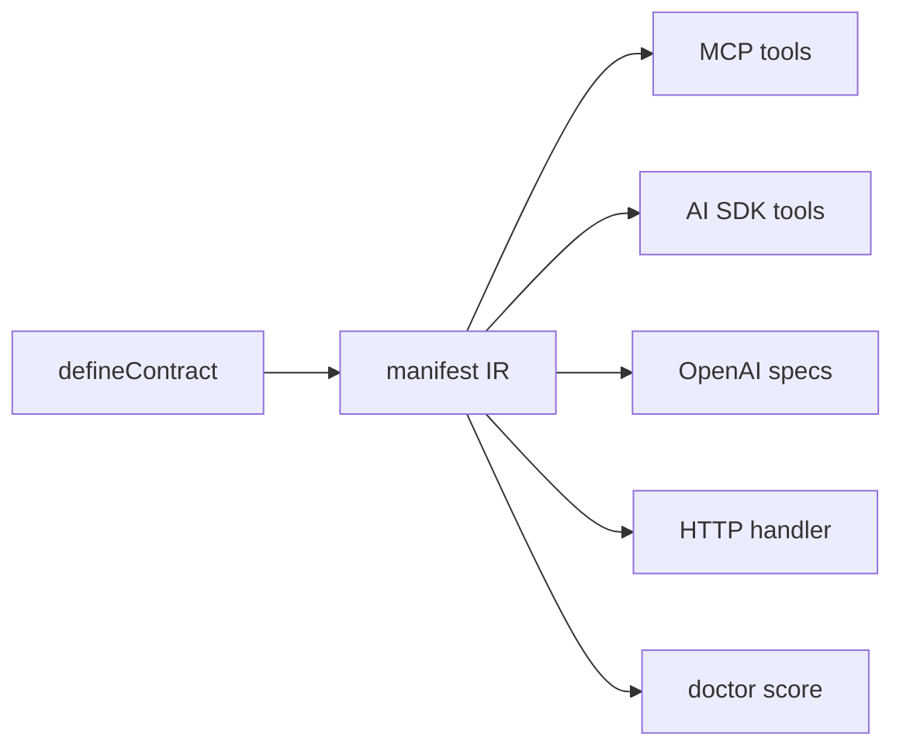

# Design

## Contract-first split

A **contract** is split from its **implementation**:

- The contract is pure, isomorphic, and zero-dependency. It carries `name`, `description`,
  `sideEffects`, `idempotency`, optional `auth`/`concurrency` metadata, and `input`/`output`
  schemas — but **never** a handler. It can ship to a browser, an edge runtime, or a separate
  client repo.
- The implementation (`implement(contract, handler)`) lives server-side and may import your DB
  and services.

A one-line `defineAction` fuses the two for trivial single-file cases; it splits the contract
back out pure, so the isomorphic guarantee holds either way.

## The manifest IR

Every contract compiles to a JSON-serializable **manifest**: per action a `name`,
`description`, `sideEffects`, `idempotency`, optional `auth`/`concurrency`, and JSON Schema for
`input`/`output` (draft 2020-12). The manifest is the single source of truth that every
surface and the `doctor` read.

Schema compilation is tiered (Standard Schema exposes only `validate()` at runtime, so a
universal converter is impossible):

1. the built-in `s` builder compiles directly (it owns its structure);
2. any schema implementing the `~standard.jsonSchema` companion spec is used as-is;
3. a registered per-vendor converter handles the rest;
4. otherwise resolution fails loudly with guidance.

A `toStrictJsonSchema()` transform derives the OpenAI Structured-Outputs variant
(`additionalProperties: false`, all-required, null-union optionals).

## Middleware

Cross-cutting concerns compose as typed middleware in `@agentora/server`:
`trace`, `auth`, `idempotency`, `concurrency`, `retry`, `redact`. They run as an onion around
the handler: input is validated first, then middleware, then the handler, then output
validation. Per-contract metadata (`sideEffects`, `idempotency`, `auth`, `concurrency`) is data
the middleware and `doctor` read. Stateful middleware take a pluggable `Store` (in-memory by
default).

## Surfaces are adapters

Each surface is a function `(app) => surface`, independently installable. Adding one surface
never pulls another into your bundle. The runtime standardizes streaming on Web Streams /
async generators and threads an `AbortSignal`, so adapters run on Node and edge runtimes alike.

